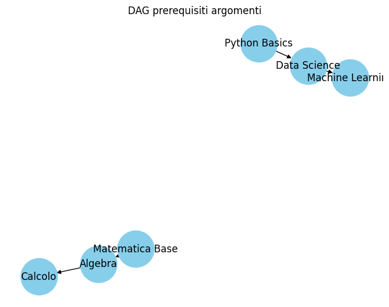
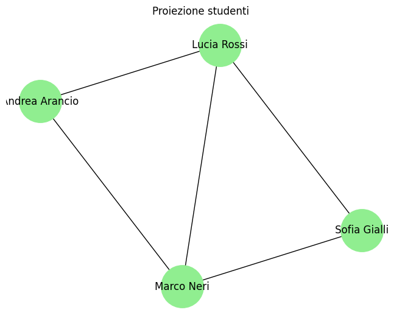
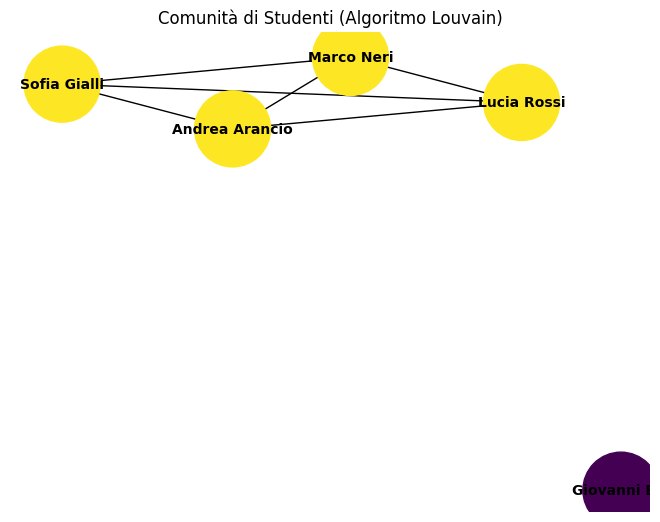

## 2. Database NoSQL a Grafi

Il secondo database rappresenta un grafo della conoscenza focalizzato sui corsi online.

I nodi (oggetti discreti del dominio) sono: 
*   Gli studenti;
*   I corsi;
*   I docenti;
*   Gli argomenti;
*   I certificati.

I nodi sono identificati tramite etichette (labels) che raggruppano le entità dello stesso tipo in insiemi differenti, consentendo di distinguerle e interrogarle in modo efficiente. Le proprietà, intese come informazioni aggiuntive sui nodi, sono presenti soltanto nei nodi dei corsi, i quali sono descritti da titolo, livello, durata e categoria. 

I tipi di relazione sono:
*   **TIENE**: Il docente tiene un corso
*   **ISCRITTO_A**: Lo studente è iscritto a un corso
*   **TRATTA**: Il corso tratta un argomento
*   **PROPEDEUTICO_A**: Un argomento è prerequisito di un altro
*   **HA_CONSEGUITO**: Lo studente ottiene un certificato
*   **ACCREDITA**: Il certificato accredita un corso

È stato utilizzato un DB a grafo in quanto il contesto dei corsi online costituisce un mini-mondo altamente interconnesso e complesso. Il database a grafo tratta le relazioni tra gli elementi come dati di prima classe; considera cioè le connessioni tra le entità importanti tanto quanto le entità stesse, memorizzandole in modo esplicito. I database relazionali, al contrario, forzano le relazioni all'interno di chiavi esterne e tabelle di JOIN, operazioni che risultano costose quando è necessario unire più tabelle per query indirette. Di conseguenza, nei database a grafo le operazioni che richiederebbero più JOIN vengono eseguite attraversando direttamente le relazioni che collegano i nodi, in quanto già memorizzate nel grafo. Questo consente di accedere a milioni di connessioni al secondo. Un altro motivo risiede nel fatto che i database a grafo permettono una maggiore flessibilità nel modello, non essendo vincolati a uno schema rigido sottostante.

In base alle relazioni e alla tipologia di grafi, il database è stato suddiviso in diverse componenti:
*   Da una parte, i nodi degli argomenti che sono prerequisiti di altri nei corsi (relazione argomento PROPEDEUTICO_A argomento) formano dei grafi aciclici diretti (DAG); si tratta cioè di grafi i cui archi scorrono in una sola direzione, nei quali non è possibile tornare al nodo di partenza seguendo il verso delle frecce ed escludendo così la presenza di cicli infiniti. Questa struttura è di fondamentale importanza nella gestione di dipendenze circolari.
*   Dall’altra parte, gli studenti, i corsi e gli argomenti insieme rappresentano un grafo k-partito (considerando esclusivamente le relazioni di iscrizione e la trattazione degli argomenti), in quanto si tratta di un grafo i cui nodi possono essere divisi in tre sottoinsiemi disgiunti e indipendenti, in modo tale che nessun arco unisca due vertici appartenenti allo stesso insieme.
*   I nodi dei docenti e dei certificati rappresentano altre tipologie di nodi del grafo di conoscenza. I docenti sono collegati ai corsi tramite la relazione TIENE, mentre i certificati rappresentano il completamento di un corso da parte di uno studente attraverso le relazioni HA_CONSEGUITO e ACCREDITA.

Il modello rappresenta un grafo sparso, nel quale manca la maggior parte dei possibili archi teorici, rendendo il grafico relativamente vuoto in termini di connessioni. La maggior parte delle reti del mondo reale, come ad esempio i grafi sociali, sono sparse perché non tutte le persone sono connesse a tutte le altre. Per questo motivo una matrice di adiacenza, nel caso di grafi sparsi, memorizzerebbe un gran numero di archi inesistenti, mentre un elenco di adiacenza cattura in modo succinto le sole relazioni reali tra i vertici, ottimizzando l’occupazione di memoria.

Il progetto ha affrontato due problemi specifici:
1.  Trovare tutti i corsi collegati a un certo argomento, direttamente o tramite prerequisiti;
2.  Individuare studenti simili perché hanno seguito corsi che condividono gli stessi argomenti.

### Risoluzione Primo Caso: Algoritmo DFS

Nel primo caso, per la risoluzione si è scelto l’algoritmo di ricerca in profondità (DFS), il quale visita sistematicamente tutti i vertici di un grafo o di un albero, cioè tutti i nodi raggiungibili a partire da un nodo iniziale, seguendo le relazioni presenti. Tale algoritmo parte da un nodo radice arbitrario e, ancora prima di aver completato la visita dei nodi dei primi livelli, si spinge verso i vertici più lontani andando in profondità; continua questo processo ricorsivamente fino a raggiungere un vicolo cieco. Incontrato un nodo privo di uscite, torna indietro al nodo inesplorato più vicino e ripete il processo finché tutti i nodi non sono stati visitati. È presente anche il set visitato: poiché i grafi possono contenere cicli, il DFS deve ricordare quali nodi ha già esplorato; senza questo meccanismo, l’algoritmo potrebbe entrare in un ciclo infinito visitando ripetutamente gli stessi vertici. Viene inoltre utilizzato uno stack per memorizzare i nodi da visitare.

A differenza della BFS, la quale esplora i nodi livello per livello, il DFS dà priorità alla profondità rispetto all’ampiezza. Il vantaggio del DFS risiede nel basso sovraccarico di memoria rispetto alla BFS, in quanto memorizza solo il percorso che sta attualmente esplorando (ovvero i nodi al livello del cammino corrente) e non l'intero livello. Tuttavia, non garantisce l'individuazione del percorso più breve tra i nodi, ma può essere utilizzato con i DAG per eseguire l’ordinamento topologico. L’ordinamento topologico dispone i vertici di un DAG in base alle relazioni di dipendenza in una sequenza lineare; il DFS consente di calcolare questo ordine in modo efficiente (in post-ordine inverso, l’opposto dell’elenco dei vertici nell’ordine in cui sono stati visitati l’ultima volta dall’algoritmo). Ogni attività viene eseguita solo dopo che gli elementi da cui dipende risultano completati; questo evita dipendenze contrastanti, garantendo un’esecuzione finita e prevedibile.

Nel caso dei nostri dati fittizi, il DFS ha riportato i seguenti risultati:

L’ordine prevede di intraprendere prima i corsi con argomenti di Matematica di base e di Python; successivamente, Algebra si attesta come prerequisito sia di Data Science che di Calcolo. Machine Learning presenta invece come prerequisito l’argomento Data Science. Questo rappresenta l’ordine logico in cui gli argomenti dovrebbero essere studiati, rispettando tutte le relazioni di propedeuticità definite nel grafo.

### Risoluzione Secondo Caso: Community Detection

Nel secondo caso si è optato per la categoria di algoritmi di Community Detection, utile a rivelare relazioni nascoste tra i nodi della rete e a identificare comunità. Prima di applicare l'algoritmo di community detection, è stata costruita una proiezione monopartita dei soli nodi studente. Due studenti vengono collegati da un arco quando hanno frequentato corsi che condividono gli stessi argomenti. Su questo nuovo grafo è quindi possibile individuare gruppi di studenti con interessi simili.

Solo 4 studenti su 5 totali inseriti nel database risultano interconnessi per via degli argomenti condivisi, mentre uno degli studenti rimane escluso dal cluster.

Sulla base dei risultati ottenuti con la proiezione, è stato applicato l’algoritmo di Louvain Modularity, il quale divide il grafo in comunità (o cluster) nel modo più significativo. Una divisione è significativa quando le connessioni tra i nodi all’interno di ciascun cluster risultano sensibilmente più forti o più dense delle connessioni tra nodi appartenenti a cluster diversi. Un modo per valutare questo aspetto è il punteggio di modularità; l'algoritmo tenta di trovare un partizionamento del grafico che massimizzi questo valore. Un ampio punteggio di modularità indica che la proporzione di connessioni osservata è significativamente più alta della probabilità di una connessione casuale, suggerendo che i legami all’interno della comunità sono forti ed è improbabile che si verifichino per puro caso. Questo indica la presenza di forti connessioni interne e di connessioni sparse tra le diverse comunità. L’algoritmo produce una struttura gerarchica di comunità ed è efficiente dal punto di vista computazionale; tale efficienza si ottiene attraverso aggiornamenti locali piuttosto che mediante un'ottimizzazione globale, la quale risulterebbe eccessivamente costosa.

L’algoritmo ha prodotto i seguenti risultati:

Nei nostri dati fittizi, la maggior parte dei nodi appartiene a una comunità principale, mentre un solo nodo è stato assegnato a un'altra comunità separata.
